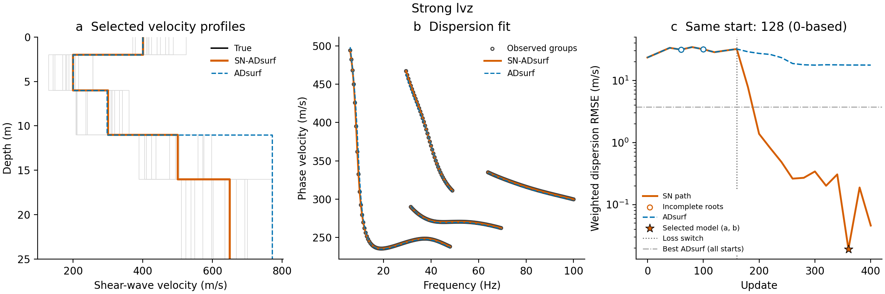

# SN-ADsurf

Slope-normalized refinement for root-free multimode surface-wave inversion.

The associated manuscript was **submitted to Earthquake Science (EQS) on
25 September 2026**. It is not yet accepted or published and has no DOI.
This repository contains the final algorithm, example data, saved numerical
results and plotting code. Manuscript files and submission documents are not included.

## Method

SN-ADsurf starts from the original ADsurf equation-residual objective. When
recent progress stalls, each initial model may switch once to a bounded
slope-normalized objective. The weights are recomputed at every update and
held fixed during that update's model gradient:

\[
w_i=\min\left(\frac{1}{|c_i^{\mathrm{obs}}|\max(|R_{c,i}|,\epsilon)},30\right),
\qquad \ell_i=\min(w_i|R_i|,100).
\]

Here \(R_i\) is the dispersion-equation residual and \(R_{c,i}\) its local
phase-velocity derivative. The slope floor is evaluated separately for each
model. The default switch checks 20-update windows, a 1% improvement threshold,
two consecutive stagnant windows and at least 80 raw-objective updates.
Adam uses cosine learning-rate decay and preserves its state across the switch.

Both paths use common initial models, bounds, regularization and observed-group
weights (4 for the fundamental group, 1 for each higher group). A complete
ADsurf path is retained. Saved candidates are screened using whole predicted
modal branches and ranked by weighted dispersion RMSE. Root searches occur
only in this selection step, not in model updates or switching.

The slope approximation is local. Better dispersion fitting is not a guarantee
of better velocity recovery. Retaining the raw candidates protects the best
eligible selection score under the common screening rule.

## Setup

Use Python 3.12. Clone the repository and install its Python dependencies:

```sh
git clone https://github.com/yaliuSW/adsurf-slope-normalized-loss.git
cd adsurf-slope-normalized-loss
python -m pip install -r requirements.txt
```

Optimization runs on CPU or a compatible CUDA device. Final model selection
requires the QEDispInv forward module; see
[the pinned installation helper](support/qedispinv_install_pack/README.md).
Plotting the saved results does not require QEDispInv.

## Run examples

Start with the small six-layer gradient example:

```sh
python examples/run.py --case gradient --out user_runs/gradient --device cpu
```

Other main examples are `strong_lvz`, `crustal` and `field`:

```sh
python examples/run.py --case strong_lvz --out user_runs/strong_lvz --device cuda:0
python examples/run.py --case field --out user_runs/field --device cuda:0
```

Each example runs the paired paths for 400 updates and then performs common
physical selection. To run optimization without an installed forward solver,
add `--skip-selection`. `--iterations` and `--workers` control the update budget
and forward-evaluation workers. Shorter runs are demonstrations, not reproductions
of the saved 400-update results. Output directories must be new.

`examples/data/` contains the exact observations, initial ensembles and bounds
used for the final comparisons, plus 20 noise realizations. Select a noise case
by its filename stem, for example `noise_iid_gaussian_seed_20260801`.
Keep the full saved ensemble batch for comparisons with frozen trajectories;
changing batch shape or numerical backend can alter floating-point paths.
The gradient input contains two identical profiles and represents one unique start.

## Plot results

Generate velocity profiles, dispersion fits and physical convergence histories from the
included numerical results:

```sh
python examples/plot.py --case field --out plots
python examples/plot.py --case strong_lvz --out plots
python examples/plot.py --noise --out plots
python examples/plot_mechanism.py --out plots
```

To plot a new run:

```sh
python examples/evaluate_history.py --case gradient --run user_runs/gradient --out user_runs/gradient/history
python examples/plot.py --case gradient --run user_runs/gradient --out plots
```

Both PNG and vector PDF are written. Panels a and b show the best eligible
models across the initial ensemble. Panel c compares **weighted dispersion RMSE
from the same initial model** on the raw and switching paths, using the start
that produced the retained winner (zero-based index in the title). The vertical
dotted line marks the loss switch; the gray horizontal line is the best ADsurf
score across all starts. The star identifies the retained model shown in panels
a and b. These are current checkpoint errors, not cumulative
best scores. Training objectives with different definitions are not joined or
compared in this panel.

Physical histories are evaluated at the saved checkpoints. Hollow markers
denote incomplete predictions: missing points are omitted within each group,
while retaining group weights of 4:1. A score is undefined if any group has no
prediction. Coverage and branch-screening status are recorded in `history.csv`;
partial scores are diagnostics only and do not relax final model selection.
The included histories for the four main cases can be plotted without QEDispInv.
To regenerate a history (requires the forward solver), run:

```sh
python examples/evaluate_history.py --case strong_lvz --out user_runs/strong_lvz_history
python examples/plot.py --case strong_lvz --history user_runs/strong_lvz_history --out plots
```

The mechanism plot uses the fixed 500-model candidate bank; 349 have complete
known-mode predictions. Its SN objective is multiplied by a fixed positive
factor for display, and the local slope approximation weakens farther from the
reference model.



## Saved comparisons

| Example | Unique starts | ADsurf weighted RMSE (m/s) | SN-ADsurf (m/s) |
| --- | ---: | ---: | ---: |
| Strong low-velocity zone | 200 | 3.719 | 0.019 |
| Six-layer gradient | 1 | 0.160 | 0.160 |
| Crustal model | 50 | 0.665 | 0.553 |
| Mirandola field data | 100 | 7.008 | 4.770 |

SN-ADsurf denotes selection from both retained paths. The field weighted
dispersion RMSE decreases by 31.9%, while differences from the borehole
reference increase slightly. The borehole is an external comparison, not a
unique ground-truth model. All 20 noise realizations are included, including
ones with poor recovery.

## Code layout

- `snadsurf/model.py`: numerical residual, slope normalization and regularization.
- `snadsurf/optimize.py`: shared optimizer and one-way refinement.
- `snadsurf/switching.py`: per-start progress rule.
- `snadsurf/selection.py`: independent forward screening and candidate retention.
- `examples/`: runnable examples, numerical inputs, saved results and plotting.
- `vendor/`: ADsurf numerical source and its license.
- `support/`: pinned QEDispInv installer and interface patch.

Run the focused tests with `python -m unittest discover -s tests -v`.
After a full 400-update example, compare its trajectory with the saved result:

```sh
python tests/check_trajectory.py --case gradient --run user_runs/gradient
```

This strict numerical check is intended for the same batch and backend.
See [data provenance](DATA_PROVENANCE.md) and [third-party notices](THIRD_PARTY_NOTICES.md).

## Citation

Until publication details are available, please cite the submitted manuscript as:

> Liu, Y., Li, S., Wu, Z., Xi, C., 2026. Slope-normalized refinement for root-free
> multimode surface-wave inversion. Manuscript submitted to Earthquake Science.

```bibtex
@unpublished{Liu2026SNADsurf,
  author = {Liu, Ya and Li, Shufeng and Wu, Zizhao and Xi, Chaoqiang},
  title = {Slope-normalized refinement for root-free multimode surface-wave inversion},
  year = {2026},
  note = {Manuscript submitted to Earthquake Science},
  url = {https://github.com/yaliuSW/adsurf-slope-normalized-loss}
}
```

Please also cite upstream ADsurf, the forward solver and the original data
sources when applicable. No article DOI or publication volume is assigned here.
